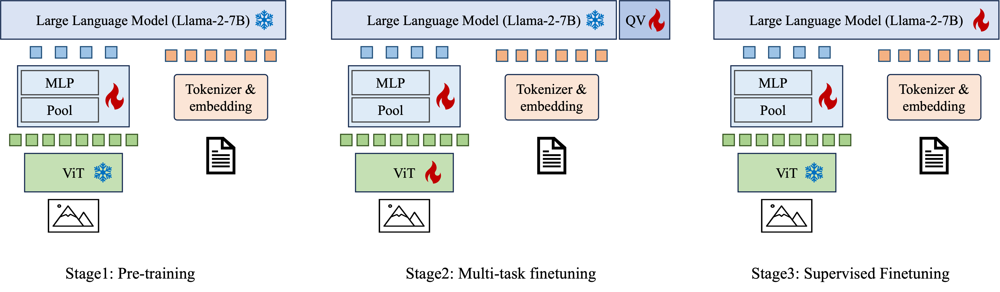

## InfMLLM: A Unified Model for Visual-Language Tasks


#### 1. Framework



#### 2. Evaluation

**MME**
To evaluate on [MME](https://github.com/BradyFU/Awesome-Multimodal-Large-Language-Models/tree/Evaluation) benchmark, run the following script.

```
checkpoint=ToOverwrite # trained model to replace
python evaluate/mme/eval_infmllm_llama.py \
    --model_type="infmllm_inference_llama" \
    --vit_model="eva_clip_g" \
    --image_size=448 \
    --vision_adapter="pooler" \
    --pool_out_size=16 \
    --lm_model="pretrain_models/lmsys/vicuna-7b-v1.5/" \
    --lm_tokenizer="pretrain_models/lmsys/vicuna-7b-v1.5/" \
    --precision="amp_bf16" \
    --conv_version="vicuna_v1" \
    --checkpoint=${checkpoint}    
```